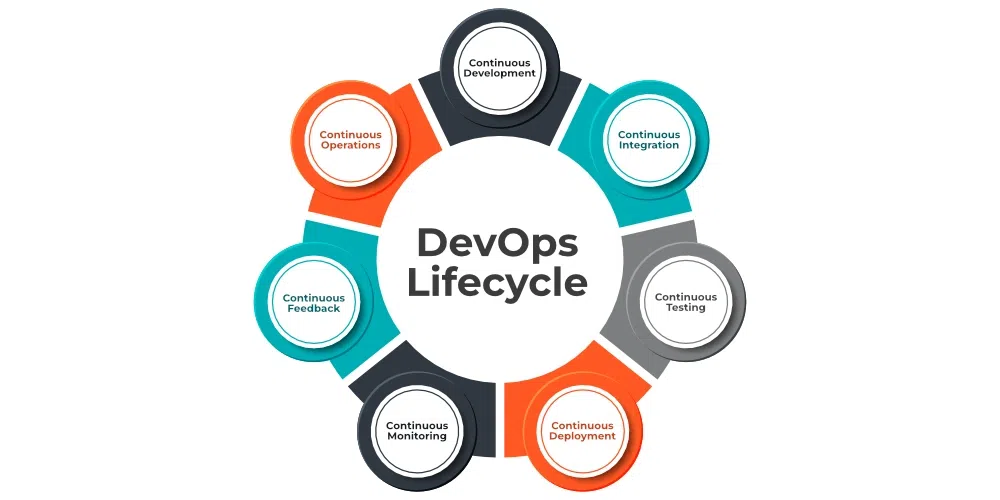
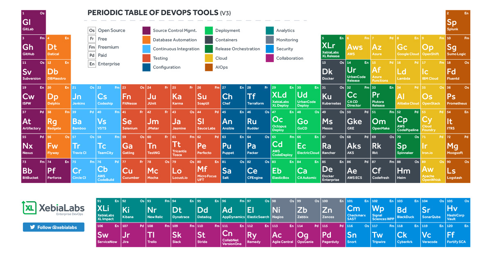

# DevOps

## What is DevOps?

`DevOps is a transformative culture and practice that unites software development (Dev) and IT operations (Ops) teams. It is a Software Development approch that emphasizes collaboration and communication between development (Dev) and operations (Ops) teams `

Imagine you and your friends are building a big LEGO castle together. Some of you are really good at building towers (developers), while others are great at making sure the castle stays strong and safe (operations). DevOps is like a magic way to help everyone work together, sharing tools and ideas, so you can build your LEGO castle super quickly and make sure it’s always strong and fun to play with.

## DevOps Lifecycle

DevOps Lifecycle is the set of phases that includes DevOps for taking part in Development and Operation group duties for quicker software program delivery.

#### 7 C's of DevOps

- Continuous Development
- Continuous Integration
- Continuous Testing
- Continuous Deployment/Continuous Delivery
- Continuous Monitoring
- Continuous Feedback
- Continuous Operation

1. `Continuous Development`: Developers writes code in small, continuous bits rather than all at once. Continuous Development is important in DevOps because this improves efficiency every time a piece of code is created, it is tested, built, and deployed into production. `Example`: Keep building your LEGO castle without stopping.

2. `Continuous Integration`: Continuous Integration can be explained mainly in 4 stages in DevOps. They are as follows:

    - Getting the SourceCode from SCM(Source Code Management) eg: GitHub
    - Building the code
    - Code quality review
    - Storing the build artifacts

    `Example`: Keep adding new LEGO pieces and making sure they fit perfectly.

3. `Continuous Testing`: Any firm can deploy continuous testing with the use of the agile and DevOps methodologies. Depending on our needs, we can perform continuous testing using automation testing tools such as Testsigma, Selenium, LambdaTest, etc.`Example`: Keep checking your LEGO castle to make sure it’s strong.

4. `Continuous Deployment`: Continuous Deployment is the process of automatically deploying an application into the production environment when it has completed testing and the build stages.

`Example`: Keep showing off your new LEGO additions to everyone.

4. `Continuous Delivery`: Continuous Delivery is the process of deploying an application into production servers manually when it has completed testing and the build stages. Here, we’ll automate the continuous integration processes, however, manual involvement is still required for deploying it to the production environment.

5. `Continuous Monitoring`: Continuous Monitoring uses tools like Prometheus and Grafana. Prometheus collects performance data like CPU and memory usage, network traffic, and error rates. Grafana helps visualize this data, allowing us to track and get notified of any issues before they become serious.`Example`: Keep an eye on your LEGO castle to make sure nothing breaks.

6. `Continuous Feedback`: Once users start using the application, they give feedback on its performance and any issues. The DevOps team analyzes this feedback and works with developers to fix any problems in the code. This process helps reduce bugs and improve the application, making it more efficient and user-friendly. Continuous Feedback enhances application performance and minimizes errors, ensuring a smoother experience for users.
`Example`: Keep asking your friends what they think about your castle and make it even better.

7. `Continuous Operations`: We will sustain the higher application uptime by implementing continuous operation, which will assist us to cut down on the maintenance downtime that will negatively impact end users’ experiences. More output, lower manufacturing costs, and better quality control are benefits of continuous operations.
`Example`: Keep everything running smoothly, so you can build and play anytime you want.

## Different Phases of the DevOps Lifecycle
1. `Plan`: Professionals determine the commercial need and gather end-user opinions throughout this level. In this step, they design a project plan to optimize business impact and produce the intended result.
2. `Code` – During this point, the code is being developed. To simplify the design process, the developer team employs lifecycle DevOps tools and extensions like Git that assist them in preventing safety problems and bad coding standards.
3. `Build` – After programmers have completed their tasks, they use tools such as Maven and Gradle to submit the code to the common code source. 
4. `Test` – To assure software integrity, the product is first delivered to the test platform to execute various sorts of screening such as user acceptability testing, safety testing, integration checking, speed testing, and so on, utilizing tools such as JUnit, Selenium, etc. 
5. `Release` – At this point, the build is prepared to be deployed in the operational environment. The DevOps department prepares updates or sends several versions to production when the build satisfies all checks based on the organizational demands.
6. `Deploy` – At this point, Infrastructure-as-Code assists in creating the operational infrastructure and subsequently publishes the build using various DevOps lifecycle tools.
7. `Operate` – This version is now convenient for users to utilize. With tools including Chef, the management department take care of server configuration and deployment at this point. 
8. `Monitor` – The DevOps workflow is observed at this level depending on data gathered from consumer behavior, application efficiency, and other sources. The ability to observe the complete surroundings aids teams in identifying bottlenecks affecting the production and operations teams’ performance. 

## DevOps Periodic Table
